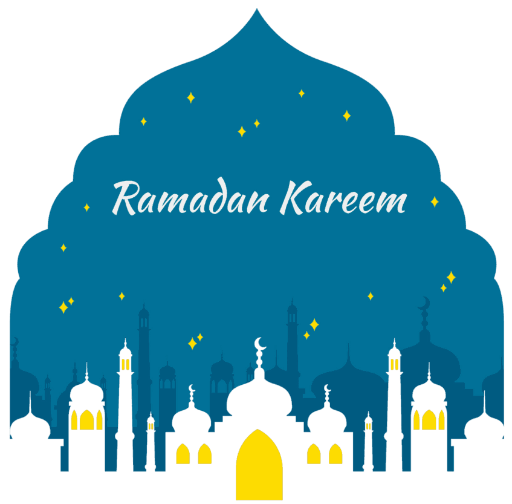

# Ramadan Mubarak

Ramadan merupakan bulan kesembilan dalam kalender Islam. Ramadan dirayakan oleh umat Muslim di seluruh dunia dengan puasa dan memperingati turunnya wahyu pertama kepada Nabi Muhammad SAW. Kata Ramadan berasal dari akar kata bahasa Arab ramiḍa atau ar-ramaḍ, yang berarti panas yang menghanguskan atau kekeringan.

# About project
Landing page ini menggunakan banyak animasi { infinite }, untuk memperindah tampilan. Saya menggunakan particles js juga, buble effect. Menutupi semua area landing page, ukuran nya yang kecil dan berbentuk bulat tidak akan terlalu menutupi content nya.
Silahkan di demo, Enjooyy...

# Demo Site
<a href="https://itsmelief.github.io/ramadan-mubarak/">https://itsmelief.github.io/ramadan-mubarak/</a>

# ScreenShot

# Let's connect with me!

    
    
    

# License
Didistribusikan di bawah MIT Licensi. Lihat `LISENSI` untuk informasi lebih lanjut.
